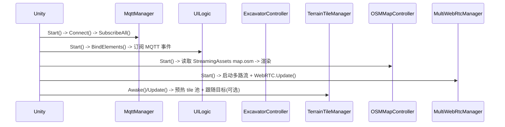

## 技术文档

### 总览
本项目是一个基于 Unity 的“挖掘机数字孪生”应用，集成了：
- **MQTT**：遥测/控制（`01/sensor/rtk_lio`、`01/joint_control`、`01/map/elevation`、`01/status`）
- **ArticulationBody**：挖掘机关节与底盘（RTK 位姿 + 关节驱动）
- **地形高程渲染**：单 Terrain 更新与 **Tile 流式地形**
- **OSM 小地图渲染**：离线 `.osm` 文件绘制到 UI Toolkit
- **WebRTC（WHEP）**：多路视频拉流到 UI Toolkit
- **UI Toolkit**：仪表盘 UI 与状态展示

运行时围绕一个**消息驱动循环**展开：
- MQTT 消息由 M2Mqtt 在后台线程接收
- 消息入队后，在 Unity 主线程 `Update()` 中统一派发
- 根据子系统特点，选择 **事件触发（Event）** 或 **直接调用（Direct Call）**

---

### 系统架构（模块划分）

#### 1) Networking / MQTT
- **入口脚本**：`Assets/map/MqttManager.cs`
- 职责：
  - 连接/订阅主题
  - M2Mqtt 回调（子线程）接收消息 → 入队
  - Unity 主线程 `Update()` 出队派发
  - `JsonUtility` 解析 JSON
  - 对外：抛事件 / 调用控制器

主要输出：
- RTK → 挖掘机根位姿更新
- Joint control → 关节目标更新
- Elevation → Terrain tile 更新
- System status → UI 更新事件

#### 2) 挖掘机控制（Articulation）
- **核心**：`Assets/Controller/ExcavatorController.cs`
- 职责：
  - 通过 `ArticulationBody.xDrive` 驱动关节（Target / Velocity）
  - RTK 位姿平滑：`TeleportRoot` + Lerp/Slerp

输入来源：
- `MqttManager` **直接调用**：`ApplyRtkPose(...)`
- `MqttManager` **直接调用**：`ApplyJointControl(...)`

#### 3) 地形高程（Terrain Elevation）
- **Tile 管理**：`Assets/Terrain/TerrainTileManager.cs`
- **缓存**：`Assets/Terrain/ElevationTileStore.cs`
- **应用器**：`Assets/Terrain/HandleElevationMap.cs`
- 职责：
  - 维护固定数量 Terrain（默认 3×3）围绕跟随目标滚动
  - 接收 `01/map/elevation`（带 `metadata.tile_x/tile_y/tile_size_meters`）并应用到对应 tile
  - 统一对齐 `TerrainData.size`，避免 tile 间距错乱
  - `HandleElevationMap` 将 `int16` 高程数组转换成 `TerrainData.SetHeights`

性能备注：
- `HandleElevationMap` 支持关闭着色（TerrainLayer/Alphamap），避免卡顿。

#### 4) OSM 地图（UI Toolkit）
- `Assets/Map/OSMMapController.cs`：加载 `.osm` 并挂载 UI 元素
- `Assets/Map/OSMMapElement.cs` / `OSMMapLayerElement.cs`：绘制与交互（拖拽/缩放）
- `Assets/Map/OSMLoader.cs`：XML 解析 `.osm`

数据位置（Build 安全）：
- `Assets/StreamingAssets/map/map.osm`

#### 5) 视频（WebRTC / WHEP）
- `Assets/Networking/WebRTC/MultiWebRtcManager.cs`：多路流管理
- `Assets/Networking/WebRTC/WebRtcSingleStream.cs`：单路流实现
- `Assets/Networking/WebRTC/WebRtcReceiver.cs`：备选/历史实现

#### 6) UI
- UXML/USS：`Assets/UI Toolkit/MainLayout.uxml`、`Assets/UI Toolkit/MainLayout.uss`
- 逻辑：`Assets/Utils/UILogic.cs`
- 职责：
  - 用 `name="..."` 查询 UI 元素并缓存
  - 订阅 MQTT 事件并更新 UI 状态

---

### 数据流

#### MQTT 接收 → 主线程派发

```mermaid
flowchart LR
  subgraph MQTT["M2Mqtt 子线程"]
    A[MqttMsgPublishReceived] --> B[入队 (topic,msg)]
  end
  subgraph Unity["Unity 主线程"]
    C[Update()] --> D[出队循环]
    D --> E[OnMessageReceived 事件]
    D --> F[DispatchByTopic switch]
  end
  B --> C
```

#### Topic 级数据流

```mermaid
flowchart TD
  T1["01/sensor/rtk_lio"] -->|JsonUtility| RTK[RtkGpsMsg]
  RTK -->|直接调用| EX1[ExcavatorController.ApplyRtkPose]
  RTK -->|事件(可选)| OBS1[地图/记录/观察者]

  T2["01/joint_control"] -->|JsonUtility| JC[JointControlMsg]
  JC -->|直接调用| EX2[ExcavatorController.ApplyJointControl]

  T3["01/map/elevation"] -->|JsonUtility| EL[ElevationMsg]
  EL -->|直接调用| TM[TerrainTileManager.OnElevationTile]
  TM --> AP[HandleElevationMap.OnElevationDataReceived]

  T4["01/status"] -->|JsonUtility| ST[SystemStatusMsg]
  ST -->|事件| UI[UILogic.OnStatusUpdated]
```

---

### 系统流程（流程图）

#### 启动流程


#### Terrain Tile 流式更新
```mermaid
flowchart TD
  P[跟随目标位置] --> WT[WorldToTile]
  WT --> CH{中心 tile 是否变化?}
  CH -->|是| RFS[RefreshActiveSet: 回收+分配 Terrain]
  CH -->|否| NOP[不变]
  EL[ElevationMsg(tile_x,tile_y)] --> TM2[TerrainTileManager.OnElevationTile]
  TM2 -->|缓存| ST[ElevationTileStore.Put]
  TM2 -->|tile 在激活集合| AP[ApplyToTerrain -> HandleElevationMap]
  TM2 -->|tile 不在激活集合| WAIT[等待走近再应用]
```

---

### 事件触发 vs 直接调用：为什么两种方式都用？

项目里刻意同时使用 **Event** 与 **Direct Call**：

#### 事件触发（低耦合）
适用场景：
- 可能有多个订阅者（UI、日志、地图、统计）
- 不希望强依赖具体对象引用
- 允许“软实时”（UI 慢一帧无所谓）

例子：
- `MqttManager.OnConnected / OnDisconnected` → UI 显示连接灯
- `MqttManager.OnStatusUpdated` → UI 刷新电池/温度/任务/故障
- `MqttManager.OnRtkUpdated` → 可被地图/轨迹等订阅

原因：
- 降低耦合，便于扩展/替换 UI
- 避免 MQTT 层直接依赖 UI 结构

#### 直接调用（仿真归属权清晰）
适用场景：
- 只有一个“权威系统”应该负责应用状态（避免多个订阅者重复应用）
- 对时序/一致性敏感（控制链路应明确、可调试）

例子：
- RTK 位姿 → `ExcavatorController.ApplyRtkPose(...)`
- 关节控制 → `ExcavatorController.ApplyJointControl(...)`
- 高程 tile → `TerrainTileManager.OnElevationTile(...)`

原因：
- 防止“多个监听者都去改位姿/改地形”的混乱
- 控制链路短、定位问题更容易

经验法则：
- **观察/展示（UI）用事件；仿真控制（地形/位姿/关节）用直接调用。**

---

### Build / 运行注意事项

#### OSM 文件加载
Build 不能稳定从 `Application.dataPath` 读取工程内文件。
请把 OSM 放在：
- `Assets/StreamingAssets/map/map.osm`

`OSMMapController` 会优先从 `Application.streamingAssetsPath` 读取。

#### UI Toolkit 字体（中文）
如果 UI 包含 CJK 字符，Build 可能出现空白（字体未打包/缺少 glyph）。
目前 UI 已转换为英文，风险降低。

---

### 已知事项 / 后续优化
- 当前仓库里存在两个 `MqttManager.cs`（`Assets/map/` 与 `Assets/Map/`）。建议合并为一个路径并统一引用，避免困惑。
- Terrain 着色（TerrainLayer/Alphamap）开销很大：建议默认关闭或只做一次初始化并复用。

